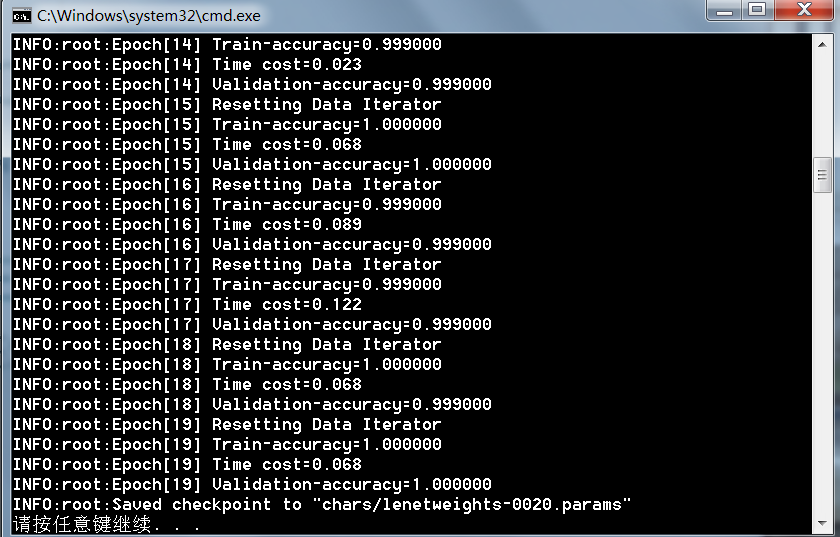
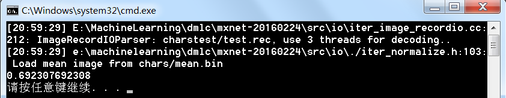

mxnet训练自己的数据
-----

作为符号式编程和命令式编程的集大成者，mxnet是caffe强有力的替代者，但是由于参考资料很少，现在并没有大规模的普及开来。

虽然此前有文章讲解了如何使用mxnet跑mnist数据集和作画，但是我们需要的是跑自己的数据集，这儿dmlc做的并不是很系统，各个点分散在好几处，给人的感觉是很乱，没有重点：

[用MXnet实战深度学习之一:安装GPU版mxnet并跑一个MNIST手写数字识别](http://phunter.farbox.com/post/mxnet-tutorial1)

[用MXnet实战深度学习之二:Neural art](http://phunter.farbox.com/post/mxnet-tutorial2)

一直想找一个mxnet跑自己数据的教程，无奈没找到，只好自己造轮子了。整个工程结构如下图所示：

其实无非就下面几个步骤：

1.在windows下安装mxnet，参见[mxnet VS2013编译.pdf](mxnet VS2013编译.pdf)文件，里面很详细的介绍了怎么编译安装mxnet0.5。

2.制作样本
chars文件夹是我从车牌识别的开源项目[easypr](https://github.com/liuruoze/EasyPR)中提取的数字0和1的字符样本，为了简单起见，我只提取了2类样本，其实一共有65类之多（字母+数字+汉字），不过只需要把图片文件拷贝过去就好，后面的操作基本一致。

双击generatetrain.bat就可以了，里面的内容很简单，无非是制作图片列表，然后用im2rec装换成它所需的格式，稍微注意下参数的含义，里面
python make_list.py chars chars/chars --recursive=True
"x64/release/im2rec" chars/chars.lst chars/ chars/train.rec

3.开始训练
双击打开VS2013的解决方案mxnettools.sln，设置mxnettools为启动项，charstrain.py为启动文件，Ctrl+F5运行即可，一点需要注意的是每次更换数据集别忘了把均值文件mean.bin删掉让它重新生成

4.进行测试
charstest是用来测试的样本，为了简单起见，我提取了前20个样本作为测试集，实际应用中避免这样做。
制作测试集合训练集的过程大致相同，把charstest.py设为启动文件就可以测试了，在训练集上早就到1的参数在测试集才只有可怜的69%，仅比随机猜测略好那么一点!

5.工程化应用
charstest.py里面已经包含了用于预测输出的代码，提取需要的部分加入到自己的工程中去吧。